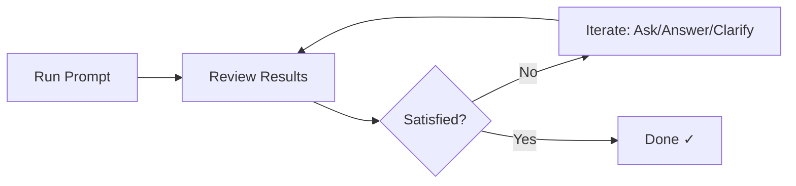

# 🚀 Copilot Kit

> A curated collection of GitHub Copilot prompts, instructions, and chat modes for modern web development

## 🎯 What is this?

This repository contains battle-tested GitHub Copilot configurations that I use daily and showcase on my [YouTube channel](https://youtube.com/@IKcodeIgorWnek). Each prompt and configuration is designed to boost your productivity and help you write better code faster.

**Star ⭐ this repo** to keep up with new additions and updates!

## 📚 Contents

### 🎨 Custom Instructions

Fine-tuned instructions for specific frameworks and patterns

| Instruction | Description | Tech Stack |
|------------|-------------|------------|
| *Coming soon* | Custom instructions for specific frameworks | *Planned* |

### 💬 Prompts

Ready-to-use prompts for common development tasks

📖 **[Read the Custom Prompts Guide](docs/custom-prompts-guide.md)** for detailed documentation on how to use and create prompts.

#### 💡 How to Work with Prompts

Prompts are starting points, not one-shot solutions—this is **AI-assisted programming**. Run the prompt, optionally provide additional context, then iterate on the results until you're satisfied.

#### 🏁 Getting Started Prompts

Use these prompts when setting up Copilot in a new or existing repository for the first time.

| Prompt | Description | Use When | Recommended Models |
|--------|-------------|----------|-------------------|
| [create-core-copilot-instruction](.github/prompts/create-core-copilot-instruction.prompt.md) | Generate a concise `copilot-instructions.md` file tailored to your project's tech stack and conventions. This file is attached to **every** Copilot conversation, so it's kept lean (50-150 lines) to avoid context pollution. | First thing to run in any new repo or when introducing Copilot to an existing project | Claude Opus 4.5 Preview (preferred), GPT-5.2 Preview |

#### 🔧 Task Prompts

Use these prompts for day-to-day development tasks.

| Prompt | Description | Category |
|--------|-------------|----------|
| [architecture-review](.github/prompts/architecture-review.prompt.md) | Focused architectural review using Sequential Thinking for multi-dimensional analysis | Architecture |
| [code-review](.github/prompts/code-review.prompt.md) | High-rigor, tech-agnostic code review that surfaces critical issues first | Code Quality |
| [pragmatic-code-review](.github/prompts/pragmatic-code-review.prompt.md) | Production-focused code review balancing engineering rigor with real-world constraints | Code Quality |
| [refactor](.github/prompts/refactor.prompt.md) | Intelligent refactoring following user instructions or applying best practices automatically | Code Quality |
| [optimize-performance](.github/prompts/optimize-performance.prompt.md) | Identify and eliminate performance anti-patterns using static analysis and language-idiomatic optimizations | Performance |
| [create-prompt](.github/prompts/create-prompt.prompt.md) | Meta-prompt to generate new custom prompts following VS Code best practices | Meta |
| [document](.github/prompts/document.prompt.md) | Generate exceptional documentation with Mermaid diagrams and practical examples | Documentation |

### 🤖 Custom Agents

Specialized Copilot agent personalities for different development scenarios

| Agent | Description | MCP Tools |
|-------|-------------|-----------|
| [backend-engineer](.github/agents/backend-engineer.agent.md) | Pragmatic backend engineer specializing in APIs, databases, and server-side architecture | Sequential Thinking, Context7 |

#### How to Use Custom Agents

1. **Copy the agent file** to your project's `.github/agents/` directory (VS Code automatically detects `.agent.md` files in this folder)
2. **Ensure required MCP servers are configured** in your `.vscode/mcp.json` (see [MCP Servers](#mcp-servers) section)
3. **Select the agent** from the agents dropdown in Copilot Chat (click on the current agent name at the top of the chat panel)
4. **Start chatting** - describe the feature, API endpoint, database operation, or issue you want to solve. You can also ask the agent to brainstorm ideas for backend architecture, API design, or database schema - it will generate multiple alternatives with trade-offs for you to choose from.

> **Note:** Custom agents require VS Code 1.106 or later.

### MCP Servers

What is MCP?

- Model Context Protocol (MCP) lets Copilot (and other MCP-capable assistants) connect to external "tool servers" for memory, project context, tools and frameworks docs, helps to structure it's thinking process, and domain-specific knowledge.
- This repo ships a ready-to-use `.vscode/mcp.json` plus a memory template (it's empty, MCP will fill it out) at `.mcp/memory.json.dist`.

#### What's In This Kit?

- `.vscode/mcp.json` - a sample configuration wiring up the servers below
- `.mcp/memory.json.dist` - template for local, per-project memory storage

#### Quick Setup

- Prerequisites
  - GitHub Copilot Chat in VSCode with MCP enabled in settings
  - Sometimes additional things like Node.js installed, etc. as required by each server (see their repos)

- Copy the memory storage template (if you want to use `memory` MCP) `.mcp/memory.json.dist` and save it as `.mcp/memory.json`
  - Initially `memory.json` is an empty file, so you can just create empty file at `.mcp/memory.json`
  - I recommend to add `.mcp/memory.json.dist` to the Git repo if you work with a team
  - ⚠️ Never commit the `.mcp/memory.json` file, it'll contain data relevant to your work
  - ⚠️ Memory file might be cleared on extensions update and in other cases, check MCP's repo
  - It's recommended to add similar instruction to your project's README so collaborators set it up too

- Copy configurations of the servers you want to use from the `.vscode/mcp.json` to your project
  - Sometimes MCP server has `${input:input-id}`in the `env` or other section, this means it's going to store some env variables in VSCode and the specific `input` is defined in the `inputs` field of the JSON configuration object at `.vscode/mcp.json`.
  - If `input` is required for a MCP server (like for `shadcn-ui`) you will be prompted for the value on the server's first startup, then it's going to be saved securely by VSCode.
  - 👍 To use `inputs` is my preferred way of storing env variables for MCP servers. I want to commit `.vscode/mcp.json`, so my team members can use them too anytime they want, without any danger of sharing the real env variables.

#### MCP Servers List

| Name | What it gives you | Notes |
|--------|-------------|----------|
| [Sequential Thinking](https://github.com/modelcontextprotocol/servers/tree/main/src/sequentialthinking) | This MCP gives the agent ability use more structured thinking process, it's really powerful when combined with the right prompts | 🌟 I use it everyday, basically all the time |
| [Memory](https://github.com/modelcontextprotocol/servers/blob/main/src/memory/README.md)| It gives your agent ability to memorise different things between conversations, it's really powerful when connected with other MCP servers or remembering some things about the project | ♥️ I combine it with Context7 to remember libraries IDs |
| [Context7](https://github.com/upstash/context7) | It allows your agent to have the best context when it comes to the newest versions of tools, libraries, frameworks, etc. | 🆓 Free for all developers! I use this whenever I need up-to-date library context. Highly recommended for every project. |
| [Shadcn UI](https://github.com/Jpisnice/shadcn-ui-mcp-server) | It gives the agent access to the Shadcn UI components and helps understand how they should be used | To me it's absolute banger. 🚀 I use it whenever I work with Shadcn UI in my projects. |
| [Chrome DevTools](https://github.com/ChromeDevTools/chrome-devtools-mcp) | Brings Chrome DevTools debugging capabilities to your agent - inspect live pages, debug network/console errors, simulate user behavior, analyze performance, and verify code changes in real-time | 🔍 Perfect for debugging web apps and performance audits |

## 🚀 Quick Start

1. **Browse** the categories above
2. **Click** on any link / prompt that interests you
3. **Copy** the content
4. **Paste** into GitHub Copilot Chat or just copy entire instruction / prompt / chat mode / MCP configuration and 💾 save in your repo
5. **Customize** for your specific needs

## 📹 Featured in Videos

- [I Can't Code Without These 3 MCP Servers (Game Changers!)](https://youtu.be/pTLrQ2c5A7M)

## 🛠️ My Tech Stack

All things in this repo are optimized for:

- **Backend**: Go, Node.js, Express, NestJS, TypeScript, PHP
- **Frontend**: React, Astro, Next.js, TailwindCSS, TanStack
- **Database**: PostgreSQL, MySQL, TypeORM, GORM, Atlas
- **DevOps**: Docker, Colima (Docker Desktop alternative),  GitHub Actions
- **Testing**: Jest, Vitest, native testing libs (Node.js, Go), Playwright

## 🤝 Contributing

Found a prompt that supercharged your workflow? Feel free to contribute!

1. Fork this repository
2. Add your prompt/instruction/chat mode
3. Follow the existing format
4. Submit a PR with a clear description

If you have a question or want to talk about some idea related to this repo - feel free to open an issue.

## 📬 Stay Connected

- **YouTube**: [IKcode Igor Wnek](https://youtube.com/@IKcodeIgorWnek) - New videos weekly
- **GitHub**: [@IgorWnek](https://github.com/IgorWnek)
- **BlueSky 🦋**: [@ikcode.dev](https://bsky.app/profile/ikcode.dev)

## 📄 License

[MIT License](LICENSE) - Use these prompts freely in your projects!

---

⭐ **If you find this useful, please star the repository!** It helps others discover these resources and motivates me to add more content.
