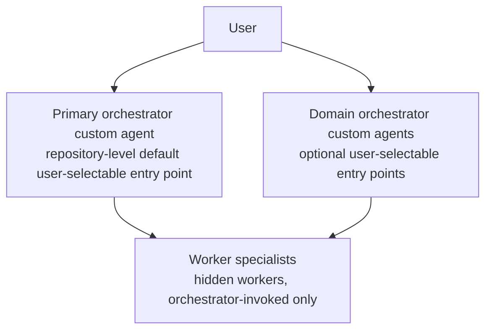

# ADR 0001: Orchestrator Architecture

## Status

Accepted

## Date

2026-03-01

## Context

`copilot-kit` is being designed as an artifact-driven, AI-assisted product engineering system intended to work in both GitHub Copilot CLI and Copilot in VS Code.

The repository needs a clear orchestration model for how users enter the system, how specialist agents are coordinated, and how workflow state is carried across phases such as discovery, specification, implementation, QA, design, and delivery.

The core tension is this:

- a richer org-chart-style architecture looks elegant on paper,
- but the practical Copilot surfaces differ in agent mechanics, tool access, and customization models,
- so the repository should avoid depending on architectural depth that is harder to execute consistently than to describe.

In this ADR, the public entry points are the user-selectable **custom agents** exposed in Copilot: selected in Copilot in VS Code and invoked or selected in Copilot CLI. Skills, slash commands, and prompt files remain useful supporting mechanisms, but they are not the primary user-facing entry model addressed here.

A decision is needed because this affects repository structure, naming, agent contracts, and future documentation.

## Decision

Use **one repository-level primary orchestrator custom agent** as the default user-selectable public entry point for `copilot-kit`.

Curated domain orchestrator custom agents are secondary public entry points for advanced users and do not replace the primary orchestrator as the default starting point.

Only orchestrator custom agents are part of the public user-selectable custom-agent surface.

That orchestrator:

- guides users through the workflow,
- delegates directly to worker specialist agents,
- coordinates work through explicit artifacts,
- supports optional parallel execution when appropriate,
- does not require nested orchestration layers to succeed.

Also decide that:

- advanced users may directly select or invoke a curated set of **domain orchestrator custom agents**,
- worker specialists are hidden execution units, not user-selectable custom agents,
- exposing single specialized worker agents directly to users is a rejected public-agent model in this repository,
- domains should be represented in repository structure, documentation, and selected public domain orchestrators,
- no core workflow should depend on nested orchestration layers,
- public domain orchestrators may use domain-facing, team-style names when that improves discoverability,
- public naming does not change the internal architecture vocabulary, which remains orchestrator / worker / artifact,
- public names should be discoverable, conservative in scope, and stable enough to avoid unnecessary renames,
- a public name must not imply repository-wide primacy unless that agent is explicitly the primary orchestrator,
- `product-definition-team` is the current user-selectable custom agent for the product-definition domain and is a domain-level public orchestrator, not the repo-wide primary orchestrator.

For DX and discoverability, the intended public surface of custom-agent entry points is:

## Alternatives considered

### 1. Thin router plus domain orchestrators

Why not now:

- depends on Copilot behavior that is not proven consistent enough across VS Code and CLI to make a core dependency,
- adds another abstraction layer before the workflow is proven,
- risks becoming routing theater,
- shifts complexity into orchestration instead of artifact contracts.

### 2. Direct public access to specialized worker agents

Examples: exposing review workers, analysis workers, or other narrow specialist agents as user-selectable custom agents.

Why not now:

- blurs the boundary between public entry points and hidden execution units,
- increases visible agent sprawl and weakens discoverability,
- makes users responsible for specialist routing that the orchestrators should handle,
- cuts against the curated hybrid model of one main orchestrator plus selected domain orchestrators.

## Consequences

### Positive

- one obvious default custom-agent entry point,
- optional domain-specific custom-agent entry points for power users,
- simpler onboarding,
- better portability across Copilot CLI and VS Code,
- room for many hidden specialist workers without exposing them as user-selectable custom agents or cluttering the visible interface,
- stronger emphasis on artifact-driven coordination,
- lower architectural complexity in v1.

### Negative / trade-offs

- the primary orchestrator must stay disciplined to avoid becoming too broad,
- the public set of domain orchestrators must stay curated so the interface does not become noisy,
- specialist contracts need to be designed carefully,
- future scale may eventually justify additional orchestration layers.

## Follow-up actions

1. Define the primary orchestrator contract.
2. Define the criteria for public domain orchestrators.
3. Define the standard worker specialist contract.
4. Define artifact handoff contracts.
5. Define visibility rules for user-selectable custom agents versus hidden workers.
6. Document platform-specific mapping for selecting or invoking public custom agents in CLI and VS Code.
7. Revisit whether additional orchestration depth is needed only after real workflow pressure proves it.
8. Capture detailed repository and agent naming policy separately; keep this ADR limited to architecture-level naming rules.

## Review trigger

Re-evaluate this ADR if any of the following become true:

- the number of specialists grows enough that one orchestrator becomes hard to maintain,
- the visible set of domain orchestrators becomes confusing or overlapping,
- a domain develops substantial reusable coordination logic that merits its own public entry point,
- Copilot runtime capabilities materially change,
- real usage shows that the single-orchestrator entry model is too limiting or confusing.
